# Tradecraft of Public Speaking

Alex Moundalexis

[@technmsg](https://twitter.com/technmsg)

Slides: [github.com/technmsg/public-speaking-tradecraft](https://github.com/technmsg/public-speaking-tradecraft)

CC BY 4.0

## Why Me?

Note: [Art Attack XXVII Stage](https://www.flickr.com/photos/techmsg/4567498297/), CC BY 2.0 <!-- SRC:misc^https://farm5.staticflickr.com/4007/4567498297_63a9fb6e8b_b.jpg -->

## Distractions

## Badges

Take off your badge

Note: [Paco Nathan @ Data Day Texas 2014](https://www.flickr.com/photos/techmsg/11889277036/), CC BY-NC <!-- SRC:misc^https://farm8.staticflickr.com/7449/11889277036_6549ec6a89_b.jpg -->

Note: [Paco Nathan at Data Day Texas 2015](https://www.flickr.com/photos/techmsg/16058584328/), CC BY-NC <!-- SRC:misc^https://farm8.staticflickr.com/7521/16058584328_57247ba983_b.jpg -->

## Phones

Turn off your phone

Leave your phone backstage

## Mic 101

Apologies to any sound engineers

Note: [Microphone on stage](https://www.flickr.com/photos/zdenadel/2301632962) by [Zach Den Adel](https://www.flickr.com/photos/zdenadel/), CC BY-ND 2.0 <!-- SRC:mics^https://farm4.staticflickr.com/3158/2301632962_f9e41e24e2_b.jpg -->

<!-- .slide: data-transition="none" -->
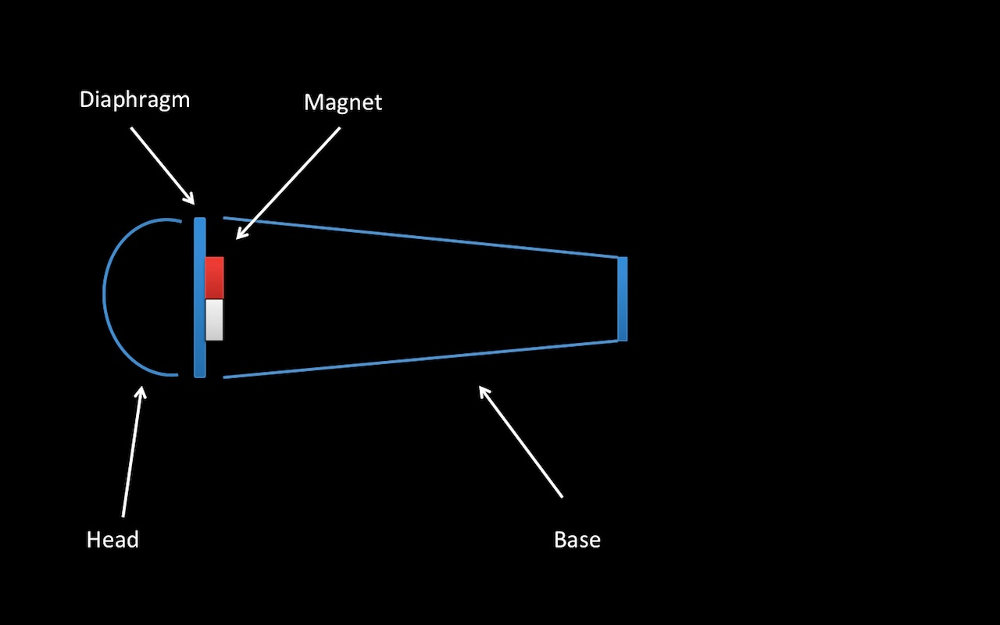

<!-- .slide: data-transition="none" -->
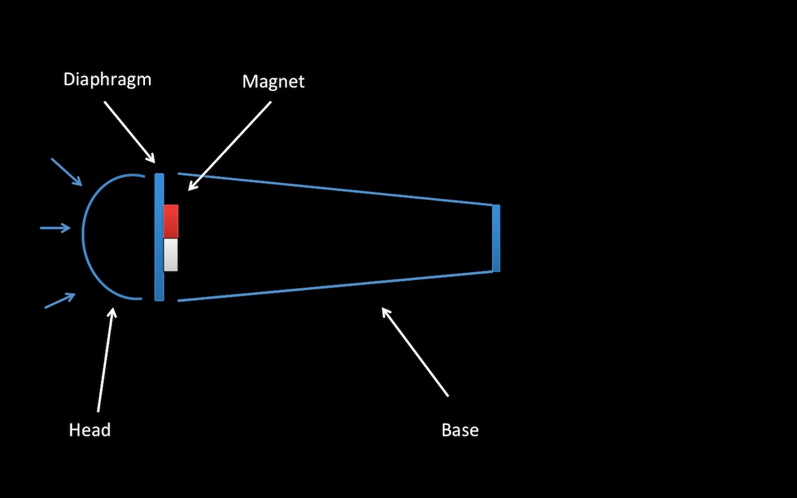

<!-- .slide: data-transition="none" -->
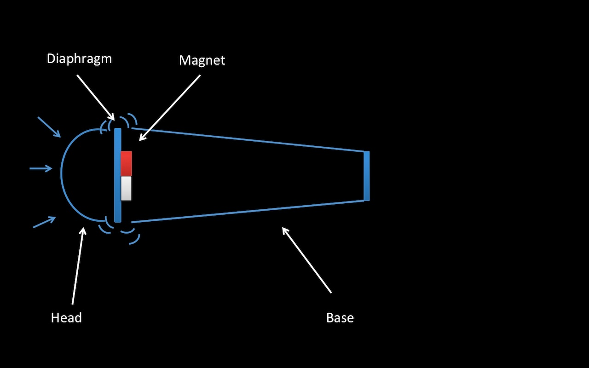

<!-- .slide: data-transition="none" -->
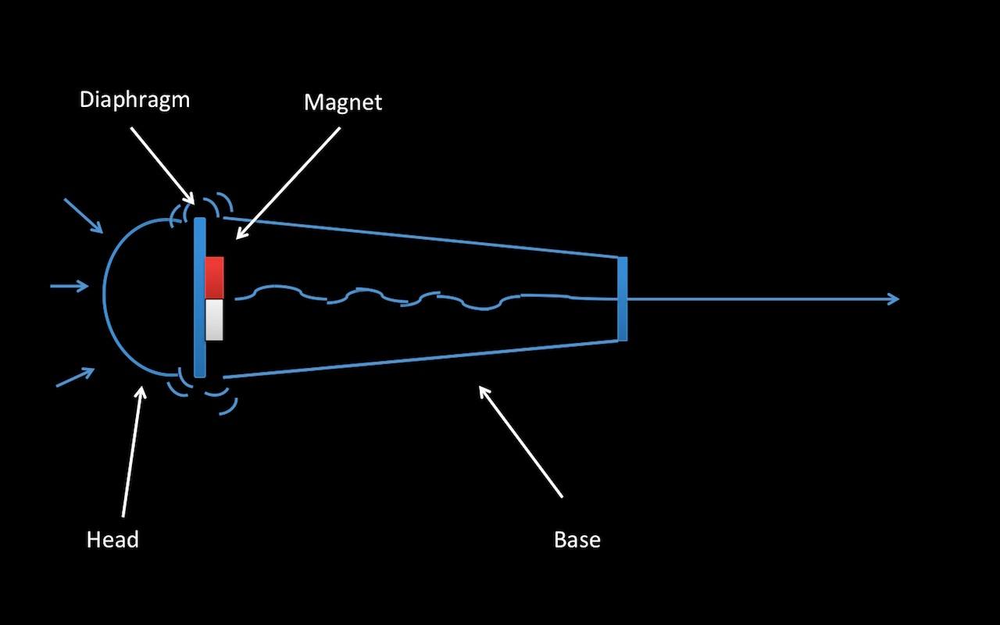

### Look familiar?

### Human ears

### Slight tangent…

### Speakers reverse it

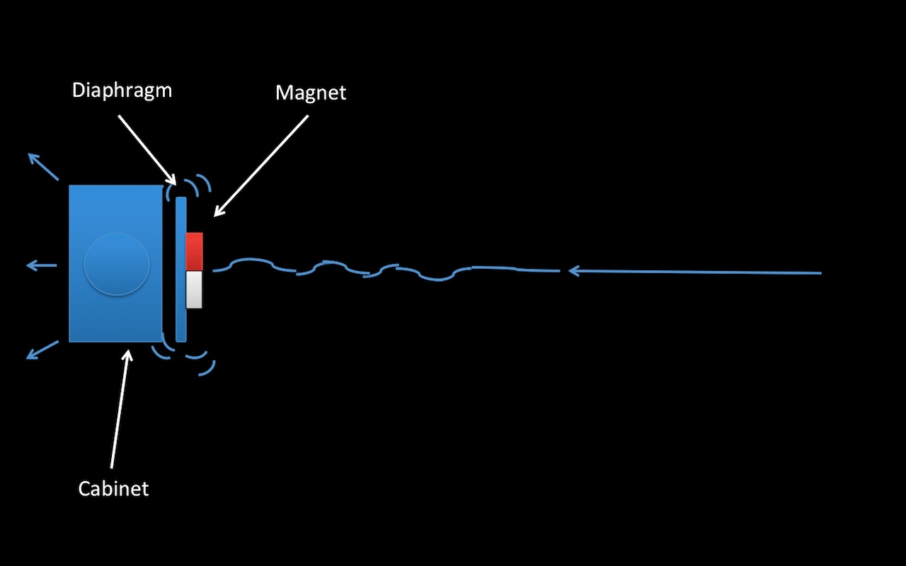

## Types

### Old

Note: [RCA 40A Ribbon Microphone](https://www.flickr.com/photos/85941395@N00/1199679274) by [John Schneider](https://www.flickr.com/photos/85941395@N00/), CC BY-NC 2.0 <!-- SRC:mics^https://farm2.staticflickr.com/1238/1199679274_509351721b_b.jpg -->

### Studio

Note: [Microphone](https://www.flickr.com/photos/mkeefe/2349283746) by [Matthew Keefe](https://www.flickr.com/photos/mkeefe/), CC BY 2.0 <!-- SRC:mics^https://farm3.staticflickr.com/2367/2349283746_7ed48c9423_b.jpg -->

### Vocal

Note: [Microphones](https://www.flickr.com/photos/rustysheriff/4880170082) by [Rusty Sheriff](https://www.flickr.com/photos/rustysheriff/), CC BY-NC 2.0 <!-- SRC:mics^https://farm5.staticflickr.com/4142/4880170082_33d603dd10_b.jpg -->

Note: [microphone](https://www.flickr.com/photos/goincase/5036393063) by [Incase](https://www.flickr.com/photos/goincase/), CC BY 2.0 <!-- SRC:mics^https://farm5.staticflickr.com/4153/5036393063_0b09f1c5d0_b.jpg -->

## Wired

Note: [Ross Nover w/ a Microphone](https://www.flickr.com/photos/techmsg/13027437443/), CC BY-NC 2.0 <!-- SRC:mics^https://farm4.staticflickr.com/3182/13027437443_9147c850f5_b.jpg -->

### Wireless

Note: [Chris Johnson @ Data Day Texas 2014](https://www.flickr.com/photos/techmsg/11889348694/), CC BY-NC 2.0 <!-- SRC:mics^https://farm4.staticflickr.com/3673/11889348694_accf7d9944_b.jpg -->

### Headset

Note: [IMG_4842](https://www.flickr.com/photos/techmsg/15558379762/), CC BY 2.0 <!-- SRC:mics^https://farm4.staticflickr.com/3949/15558379762_0e8146b926_b.jpg -->

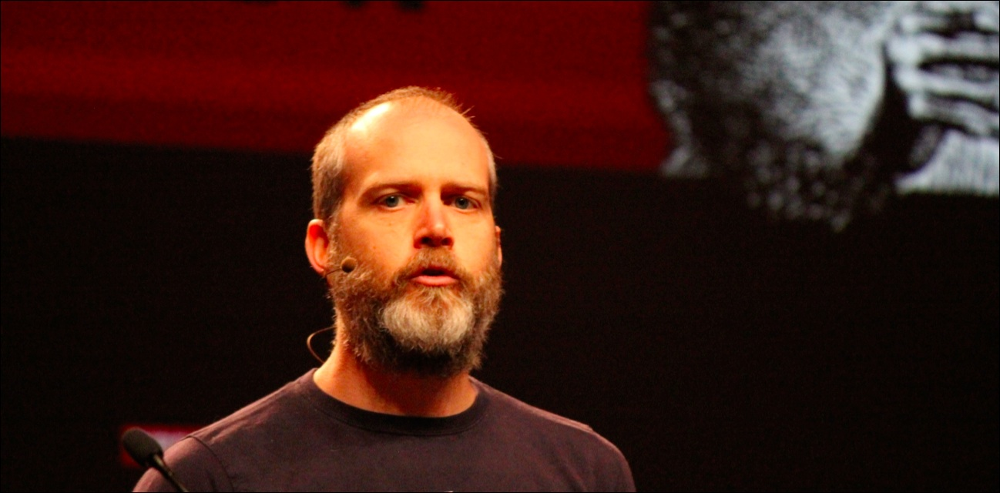
Note: [IMG_3061](https://www.flickr.com/photos/techmsg/14551999268/)

<!-- .slide: data-transition="none" -->

Note: [IMG_2418](https://www.flickr.com/photos/techmsg/14323232346/)

<!-- .slide: data-transition="none" -->
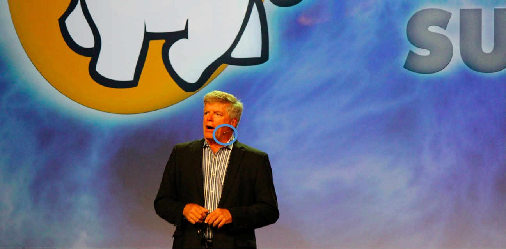

### Lapel
### Lavelier
### Body

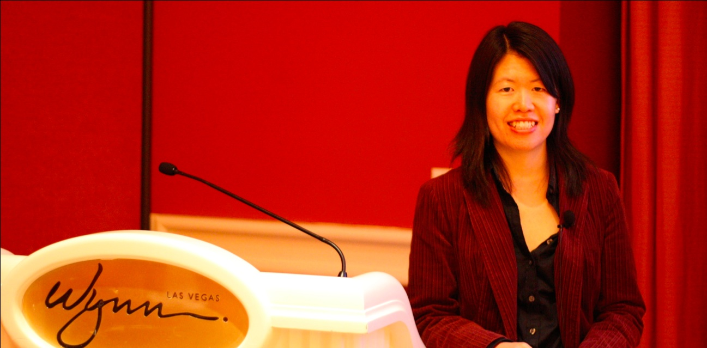
Note: Not pointing out the podium mic, rather the lavelier.

<!-- .slide: data-transition="none" -->
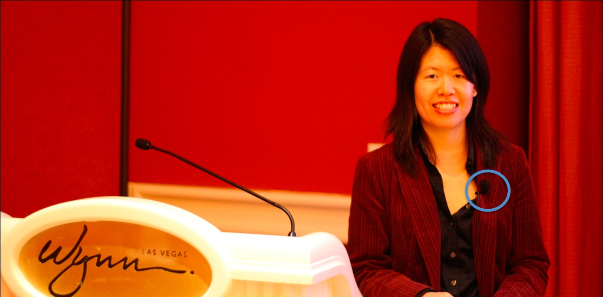

## Mounts

Note: [Kate Ting at Podium](https://www.flickr.com/photos/techmsg/10072164323/), CC BY-NC 2.0 <!-- SRC:mounts^https://farm8.staticflickr.com/7302/10072164323_06e9ed6571_b.jpg -->

Note: [Justin at Podium](https://www.flickr.com/photos/techmsg/15548996321/), CC BY 2.0 <!-- SRC:mounts^https://farm6.staticflickr.com/5611/15548996321_cae02e1f81_b.jpg -->

Note: [IMG_2893](https://www.flickr.com/photos/techmsg/14758792293/), CC BY-NC 2.0 <!-- SRC:mounts^https://farm4.staticflickr.com/3856/14758792293_4362e9df44_b.jpg -->

Note: [Matt Hutchison](https://www.flickr.com/photos/techmsg/6889269626/), CC BY-NC 2.0 <!-- SRC:mounts^https://farm8.staticflickr.com/7213/6889269626_ab42bb15fb_b.jpg -->

## Cable Management

Note: [github t-shirt](https://www.flickr.com/photos/techmsg/14738914735/), CC BY-NC 2.0 <!-- SRC:cable^https://farm3.staticflickr.com/2922/14738914735_0597903131_b.jpg -->

Note: [Mark Grover at Data Day Texas 2015](https://www.flickr.com/photos/techmsg/15624171444/), CC BY-NC 2.0 <!-- SRC:cable^https://farm8.staticflickr.com/7508/15624171444_b1db9d80c9_b.jpg -->

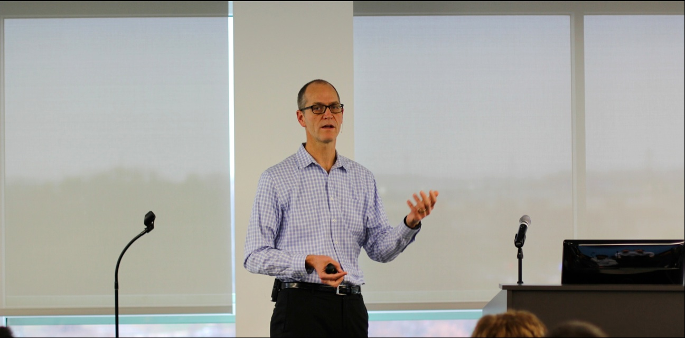
Note: [IMG_4967](https://www.flickr.com/photos/techmsg/15959385295/)

<!-- .slide: data-transition="none" -->
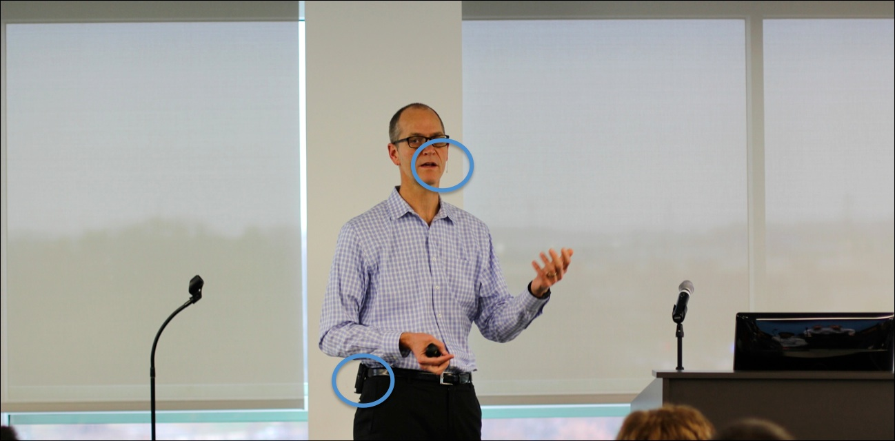

## Placement

### Placement matters

Note: [Live Harmonica at RNR XXI](https://www.flickr.com/photos/techmsg/4408859939), CC BY-NC 2.0 <!-- SRC:placement^https://farm3.staticflickr.com/2761/4408859939_d3378828c1_b.jpg -->

Note: [Camilo Rueda López](https://www.flickr.com/photos/kozumel/5947397583) by [Jakabo](https://www.flickr.com/photos/kozumel/), CC BY-ND 2.0 <!-- SRC:placement^https://farm7.staticflickr.com/6025/5947397583_e1b89850b0_b.jpg -->

Note: [Rivers Cuomo Sings to the Front Row](https://www.flickr.com/photos/techmsg/4568200730/), CC BY 2.0 <!-- SRC:placement^https://farm5.staticflickr.com/4036/4568200730_1feac0e9cb_b.jpg -->

Note: [Don't Stop Believin'](https://www.flickr.com/photos/techmsg/4409658538/), CC BY-NC 2.0 <!-- SRC:placement^https://farm5.staticflickr.com/4040/4409658538_f9050dbc76_b.jpg -->

Note: [The Exit is Behind You](https://www.flickr.com/photos/techmsg/13027865334/), CC BY-NC 2.0 <!-- SRC:placement^https://farm8.staticflickr.com/7445/13027865334_39b13087db_b.jpg -->

Note: [IMG_4756](https://www.flickr.com/photos/techmsg/15552516772), CC BY 2.0 <!-- SRC:placement^https://farm4.staticflickr.com/3947/15552516772_63c4186ee4_b.jpg -->

Note: [Charity Majors at DDTX15](https://www.flickr.com/photos/techmsg/16249254925/), CC BY-NC 2.0 <!-- SRC:placement^https://farm8.staticflickr.com/7484/16249254925_1c09e7daca_b.jpg -->

## So what?

### Why does any of this matter?

Note: [subs + front fill](https://www.flickr.com/photos/techmsg/14758796783/), CC BY 2.0 <!-- SRC:misc^https://farm4.staticflickr.com/3889/14758796783_2a582d8177_b.jpg -->

Note: [digidesign console](https://www.flickr.com/photos/techmsg/4409685016/), CC BY 2.0 <!-- SRC:misc^https://farm5.staticflickr.com/4018/4409685016_d8d2c099bb_b.jpg -->

Note: [digidesign plugins](https://www.flickr.com/photos/techmsg/13010185464/), CC BY 2.0 <!-- SRC:misc^https://farm3.staticflickr.com/2224/13010185464_9b6ba923f2_b.jpg -->

### Our fancy toys depend on signal

# Break?

Note: [Swag Kid](https://www.flickr.com/photos/techmsg/14715909126/), CC BY-NC 2.0 <!-- SRC:misc^https://farm4.staticflickr.com/3855/14715909126_c57449feb6_b.jpg -->

## Lighting

### I can't see a damned thing!

Note: [Bare Truss](https://www.flickr.com/photos/techmsg/4314273631/), CC BY 2.0 <!-- SRC:lighting^https://farm3.staticflickr.com/2723/4314273631_1bf03c6a2e_b.jpg -->

Note: [Dual Source 4 Pole](https://www.flickr.com/photos/techmsg/16545012754/), CC BY 2.0 <!-- SRC:lighting^https://farm8.staticflickr.com/7599/16545012754_aee891438e_b.jpg -->

Note: [Looking Out](https://www.flickr.com/photos/techmsg/4449896796/), CC BY-NC 2.0 <!-- SRC:lighting^https://farm5.staticflickr.com/4003/4449896796_b2349afe14_b.jpg -->

Note: [Looking Up](https://www.flickr.com/photos/techmsg/4449122271/), CC BY-NC 2.0 <!-- SRC:lighting^https://farm3.staticflickr.com/2723/4449122271_1cecaf38b7_b.jpg -->

Note: [Lycian SuperStar 1.2](https://www.flickr.com/photos/techmsg/2446057661/), CC BY 2.0 <!-- SRC:lighting^https://farm4.staticflickr.com/3100/2446057661_22184f971d_o.jpg -->

Note: [Pair of Lycian SuperStar Spots](https://www.flickr.com/photos/techmsg/2446058167/), CC BY 2.0 <!-- SRC:lighting^https://farm4.staticflickr.com/3042/2446058167_83e83dc2c0_o.jpg -->

Note: [Dancing Like The King](https://www.flickr.com/photos/techmsg/4432366766), CC BY 2.0 <!-- SRC:lighting^https://farm5.staticflickr.com/4025/4432366766_aefcb52f28_b.jpg -->

Note: [Lit audience](https://www.flickr.com/photos/techmsg/13167374713/), CC BY-NC 2.0 <!-- SRC:lighting^https://farm8.staticflickr.com/7329/13167374713_fc26a82133_b.jpg -->

Note: [Lycian 1290XLT and Road Case](https://www.flickr.com/photos/techmsg/2461560051/), CC BY 2.0 six feet in height. <!-- SRC:lighting^https://farm3.staticflickr.com/2190/2461560051_ace10694eb_o.jpg -->

Note: [Wyclef at Art Attack 2008](https://www.flickr.com/photos/techmsg/2461563599/), CC BY 2.0 <!-- SRC:lighting^https://farm4.staticflickr.com/3055/2461563599_c6abc3d0df_o.jpg -->

### Stay on the stage

Note: At the Cloudera Federal Forum, the Director of DISA (Defense Information Systems Agency) [started walking around]((https://www.flickr.com/photos/techmsg/16456582598/)) (CC BY-NC 2.0). As a result, most of the audience couldn't see him and he likely didn't appear on the recording. <!-- SRC:lighting^https://farm9.staticflickr.com/8601/16456582598_9437d1d183_b.jpg -->

## Inclusion

### Look at your audience
Note: Pan the room. Slowly. Not head on swivel.

### Repeat all questions
Note: Moreso if video. Remote employees.

### Yes, you need a mic
Note: Don’t poll your audience, asking if they can hear you.

## Errata

## Image Credits

Images copyright Alex Moundalexis unless otherwise noted. All images Creative Commons licensed.

[Microphone](https://www.flickr.com/photos/mkeefe/2349283746) by [Matthew Keefe](https://www.flickr.com/photos/mkeefe/)  
[Microphones](https://www.flickr.com/photos/rustysheriff/4880170082) by [Rusty Sheriff](https://www.flickr.com/photos/rustysheriff/)  
[RCA 40A Ribbon Microphone](https://www.flickr.com/photos/85941395@N00/1199679274) by [John Schneider](https://www.flickr.com/photos/85941395@N00/)  
[microphone](https://www.flickr.com/photos/goincase/5036393063) by [Incase](https://www.flickr.com/photos/goincase/)  
[Microphone on stage](https://www.flickr.com/photos/zdenadel/2301632962) by [Zach Den Adel](https://www.flickr.com/photos/zdenadel/)  
[Camilo Rueda López](https://www.flickr.com/photos/kozumel/5947397583) by [Jakabo](https://www.flickr.com/photos/kozumel/)

## More Words

Tradecraft of Public Speaking

[http://bit.ly/1DcMZaL](http://bit.ly/1DcMZaL)

Slides

[github.com/technmsg/public-speaking-tradecraft](https://github.com/technmsg/public-speaking-tradecraft)

## Thanks

Alex Moundalexis

[@technmsg](https://twitter.com/technmsg)
